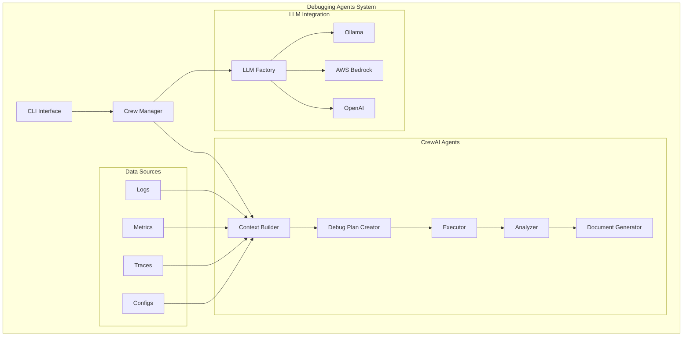
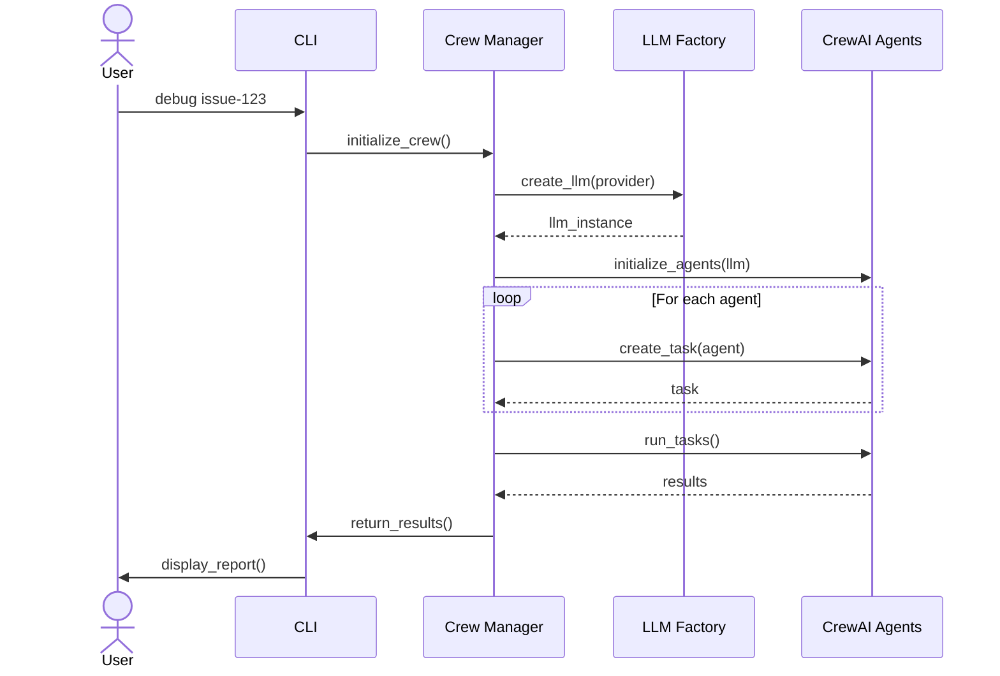

# Debugging Agents Architecture

This document outlines the high-level architecture of the Debugging Agents system, a platform designed to automate troubleshooting and debugging of complex production systems.

## System Overview

The Debugging Agents system is an LLM-powered automated debugging platform that collects contextual information about system issues, creates detailed debugging plans, executes those plans, analyzes results, and generates comprehensive reports. The system can also forecast potential issues before they occur.


## Architecture Diagram (Interactive)



## Core Components

### Crew Manager

The Crew Manager (`DebugCrew`) is the central orchestrator that:
- Initializes and manages specialized debugging agents
- Handles LLM provider configuration and integration
- Coordinates the debugging workflow
- Manages task execution and agent communication
- Supports both direct API calls and CrewAI integration

### LLM Factory

The LLM Factory provides a unified interface for different LLM providers:
- OpenAI (GPT-4, etc.)
- AWS Bedrock (Claude, etc.)
- Ollama (local models)
- Handles provider-specific configuration and API calls
- Manages environment variables and credentials

### CrewAI Agents

The system uses CrewAI for agent orchestration and collaboration:

#### Context Builder
- Aggregates system information from various sources
- Supports multiple log sources (Loki, local files)
- Creates comprehensive context for debugging

#### Debug Plan Creator
- Analyzes context using LLM
- Generates structured debugging plans
- Optimizes steps based on system state

#### Executor
- Implements debugging plans
- Manages command execution
- Handles errors and retries
- Supports both automated and interactive modes

#### Analyzer
- Interprets execution results
- Identifies root causes
- Generates recommendations
- Evaluates confidence levels

#### Document Generator
- Produces debugging reports
- Supports multiple formats (HTML, Markdown)
- Uses customizable templates
- Includes metrics and analysis

## Process Flow



## Data Flow

1. **Issue Identification**: System receives issue ID or alert
2. **LLM Initialization**: Crew Manager configures appropriate LLM provider
3. **Agent Setup**: CrewAI agents are initialized with the LLM
4. **Context Collection**: Context Builder gathers system information
5. **Plan Creation**: Debug Plan Creator generates structured plan
6. **Execution**: Executor implements debugging steps
7. **Analysis**: Analyzer evaluates results and identifies causes
8. **Documentation**: Document Generator creates detailed report

## Technology Stack

### Core Technologies
- **Language**: Python 3.10+
- **Agent Framework**: CrewAI
- **LLM Integration**: 
  - OpenAI API
  - AWS Bedrock
  - Ollama (local models)

### Dependencies
- **HTTP Client**: httpx
- **Configuration**: PyYAML
- **Logging**: Python standard logging
- **Documentation**: Markdown, HTML

### Development Tools
- **Type Checking**: Python type hints
- **Testing**: pytest
- **Documentation**: MkDocs

## Security Model

### API Key Management
- Environment variable-based configuration
- Support for AWS credentials
- Secure key storage recommendations

### Execution Safety
- Controlled command execution
- Error handling and validation
- Resource usage limits

### Data Protection
- Log redaction capabilities
- Configurable data retention
- Access control options

## Configuration

### LLM Configuration
```yaml
llm:
  provider: ollama  # or openai, bedrock
  model: deepseek-r1:8b
  temperature: 0.2
  api_base: http://localhost:11434  # for Ollama
```

### Logging Configuration
```yaml
logging:
  level: INFO
  handlers:
    - console
    - file
  format: "%(asctime)s - %(name)s - %(levelname)s - %(message)s"
```

### Agent Configuration
```yaml
agents:
  context_builder:
    enabled: true
    log_sources: ["loki", "files"]
  executor:
    timeout: 300
    max_retries: 3
```

## Deployment Options

### Local Development
- Run directly with Python
- Use Ollama for local LLM
- Local file system for storage

### Production Deployment
- Containerized deployment
- Cloud-based LLM providers
- Centralized logging
- Monitoring integration

### Hybrid Setup
- Mix of local and cloud components
- Flexible LLM provider selection
- Scalable agent deployment

## Extension Points

The system is designed with several extension points:

- **Custom Data Sources**: Add new integration points for logs, metrics, and other telemetry
- **Execution Plugins**: Support for custom debugging actions specific to different technologies
- **Report Templates**: Customizable document templates for different audiences
- **Custom Analyzers**: Specialized analysis modules for specific types of systems

## References

- [API Reference](api_reference.md) - Detailed API documentation
- [Usage Guide](usage_guide.md) - How to use the debugging agents CLI 