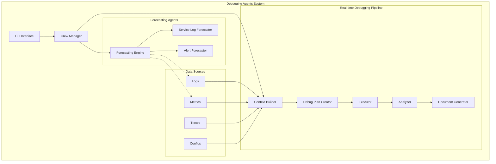
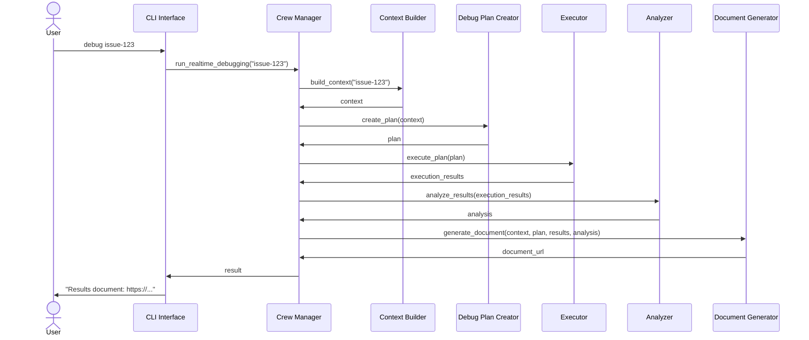

# Debugging Agents Architecture

This document outlines the high-level architecture of the Debugging Agents system, a platform designed to automate troubleshooting and debugging of complex production systems.

## System Overview

The Debugging Agents system is an LLM-powered automated debugging platform that collects contextual information about system issues, creates detailed debugging plans, executes those plans, analyzes results, and generates comprehensive reports. The system can also forecast potential issues before they occur.

## Architecture Diagram (Interactive)

## Core Components

### Context Builder

The Context Builder aggregates relevant information about the system being debugged from various sources:
- Logs from centralized logging systems
- Metrics from monitoring platforms
- Distributed traces from tracing systems
- Configuration information from config repositories and service discovery
- System status and health checks

This component creates a comprehensive context object that serves as the foundation for debugging activities.

### Debug Plan Creator

The Debug Plan Creator uses an LLM to analyze the context gathered and generate a structured debugging plan. The plan consists of a series of steps, each with specific actions and parameters. The plan is optimized based on the system's symptoms and follows best practices for troubleshooting the specific technology stack.

### Executor

The Executor is responsible for implementing the debugging plan by:
- Running each step in the appropriate sequence
- Interfacing with the target system to execute diagnostic commands
- Collecting output from each step
- Managing execution state and handling errors
- Supporting both automated and interactive execution modes

### Analyzer

The Analyzer uses an LLM to interpret the results of plan execution, identify root causes, and generate recommendations. It evaluates the confidence of its findings and suggests next steps or alternative approaches if needed.

### Document Generator

The Document Generator produces comprehensive debugging reports in various formats (HTML, Markdown, PDF). These reports include:
- Executive summary of findings
- Detailed analysis of the issue
- Step-by-step troubleshooting process
- Evidence collected during debugging
- Recommendations for fixing the issue and preventing similar problems

### Forecasting Engine

The Forecasting Engine analyzes system patterns and historical data to predict potential issues before they occur. It uses ML models and LLMs to:
- Identify anomalous patterns
- Correlate system behaviors with historical incidents
- Generate alerts for potential future failures
- Provide early warning recommendations

### Crew Manager

The Crew Manager orchestrates the end-to-end debugging process by:
- Initiating and coordinating all components
- Managing the workflow between components
- Providing a unified interface for running debugging and forecasting pipelines
- Handling resource allocation and dependencies

## Process Flow Diagram

## Data Flow

1. **Issue Identification**: The system receives an issue identifier, either manually provided or generated by the Forecasting Engine.

2. **Context Collection**: The Context Builder gathers relevant information about the issue from various data sources.

3. **Plan Creation**: The Debug Plan Creator analyzes the context and generates a structured debugging plan.

4. **Plan Execution**: The Executor implements the debugging plan, interacting with the target system and collecting outputs.

5. **Result Analysis**: The Analyzer evaluates execution results to identify root causes and generate recommendations.

6. **Document Generation**: The Document Generator creates a comprehensive debugging report.

7. **Feedback Loop**: Results are used to improve future debugging plans and forecasting accuracy.

## Deployment Model

The Debugging Agents system can be deployed in various configurations:

### Standalone CLI Tool
- Single binary or script that can be run locally
- Connects to remote data sources as needed
- Suitable for ad-hoc debugging by engineers

### Integrated Service
- Deployed as a microservice within the target environment
- Can be triggered automatically by monitoring systems
- Integrates with existing observability platforms

### Hybrid Model
- Core components run as centralized services
- Executor agents can be deployed closer to target systems
- Balances accessibility with execution capabilities

## Technology Stack

- **Language**: Python
- **LLM Integration**: Support for OpenAI, AWS Bedrock, and Ollama
- **Data Storage**: JSON/YAML for configuration, SQLite for local persistence
- **Output Formats**: HTML, Markdown, PDF
- **Interface**: CLI and API options

## Security Model

- **API Key Management**: Secure handling of LLM provider credentials
- **Execution Sandboxing**: Controlled environment for running debugging commands
- **Access Control**: Role-based permissions for debugging operations
- **Data Protection**: Redaction of sensitive information in logs and reports

## Extension Points

The system is designed with several extension points:

- **Custom Data Sources**: Add new integration points for logs, metrics, and other telemetry
- **Execution Plugins**: Support for custom debugging actions specific to different technologies
- **Report Templates**: Customizable document templates for different audiences
- **Custom Analyzers**: Specialized analysis modules for specific types of systems

## References

- [API Reference](api_reference.md) - Detailed API documentation
- [Usage Guide](usage_guide.md) - How to use the debugging agents CLI 