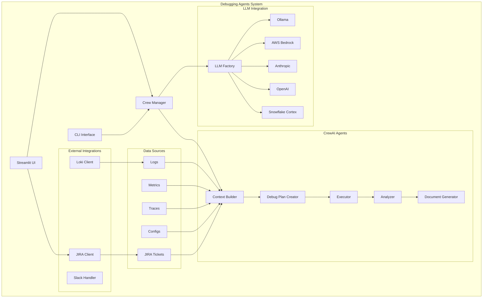
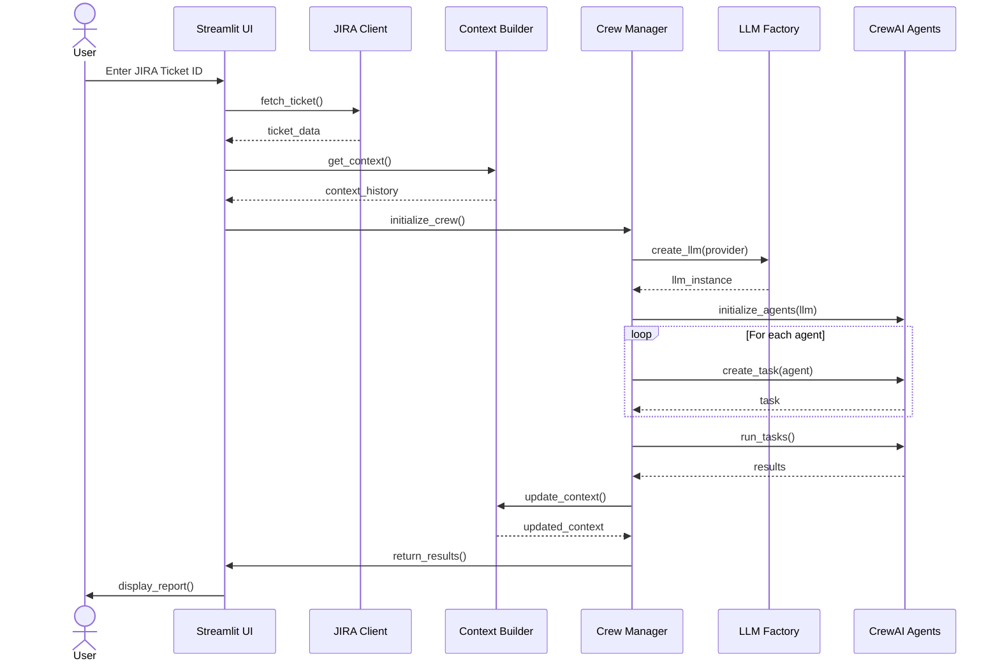

# Debugging Agents Architecture

This document outlines the high-level architecture of the Debugging Agents system, a platform designed to automate troubleshooting and debugging of complex production systems.

## System Overview

The Debugging Agents system is an LLM-powered automated debugging platform that:
- Collects contextual information about system issues
- Creates detailed debugging plans
- Executes those plans
- Analyzes results
- Generates comprehensive reports
- Integrates with external systems (JIRA, Loki, etc.)
- Preserves context across debugging sessions


## Architecture Diagram (Interactive)



## Core Components

### User Interfaces

#### Streamlit UI
- Web-based interface for JIRA ticket debugging
- BIM document generation with multiple format support (doc, pdf)
- Real-time analysis visualization
- Context history viewing
- Document download capabilities with:
  - Side-by-side format selector and download button
  - Format conversion using pure Python libraries (WeasyPrint, python-docx)
  - Graceful error handling with fallback mechanisms
  - Status messages and progress indicators

#### CLI Interface
- Command-line interface for debugging
- Scriptable automation support
- Batch processing capabilities

### External Integrations

#### JIRA Integration
- Ticket data fetching
- Fallback to local documents
- Error handling and logging
- Context preservation

#### Loki Integration
- Log collection and analysis
- Real-time log streaming
- Error pattern detection

#### Slack Integration
- Alert notifications
- Report sharing
- Interactive debugging

### Crew Manager

The Crew Manager (`DebugCrew`) is the central orchestrator that:
- Initializes and manages specialized debugging agents
- Handles LLM provider configuration and integration
- Coordinates the debugging workflow
- Manages task execution and agent communication
- Supports both direct API calls and CrewAI integration

### Context Builder

The Context Builder manages debugging context:
- Collects and organizes system information
- Preserves context across sessions
- Supports multiple data sources
- Maintains context history
- Provides context-aware debugging

### LLM Factory

The LLM Factory provides a unified interface for different LLM providers:
- OpenAI (GPT-4, etc.)
- Anthropic (Claude, etc.)
- AWS Bedrock (Claude and other models)
- Ollama (local models)
- Snowflake Cortex AI (Llama 3, etc.)
- Handles provider-specific configuration and API calls
- Manages environment variables and credentials

### CrewAI Agents

The system uses CrewAI for agent orchestration and collaboration:

#### Context Builder
- Aggregates system information from various sources
- Supports multiple log sources (Loki, local files)
- Creates comprehensive context for debugging

#### Debug Plan Creator
- Analyzes context using LLM
- Generates structured debugging plans
- Optimizes steps based on system state

#### Executor
- Implements debugging plans
- Manages command execution
- Handles errors and retries
- Supports both automated and interactive modes

#### Analyzer
- Interprets execution results
- Identifies root causes
- Generates recommendations
- Evaluates confidence levels

#### Document Generator
- Produces debugging reports
- Supports multiple formats (HTML for internal processing, doc and pdf for export)
- Uses customizable templates
- Includes metrics and analysis

## Process Flow



## Data Flow

1. **Issue Identification**: System receives JIRA ticket ID
2. **Ticket Data Collection**: JIRA client fetches ticket data
3. **Context Retrieval**: Context Builder loads existing context
4. **LLM Initialization**: Crew Manager configures appropriate LLM provider
5. **Agent Setup**: CrewAI agents are initialized with the LLM
6. **Context Collection**: Context Builder gathers system information
7. **Plan Creation**: Debug Plan Creator generates structured plan
8. **Execution**: Executor implements debugging steps
9. **Analysis**: Analyzer evaluates results and identifies causes
10. **Context Update**: Context Builder preserves new context
11. **Documentation**: Document Generator creates detailed report

## Technology Stack

### Core Technologies
- **Language**: Python 3.10+
- **Agent Framework**: CrewAI
- **UI Framework**: Streamlit
- **LLM Integration**: 
  - OpenAI API
  - Anthropic API
  - AWS Bedrock
  - Ollama (local models)
  - Snowflake Cortex AI

### Dependencies
- **HTTP Client**: httpx
- **Configuration**: PyYAML
- **Logging**: Python standard logging
- **Documentation**: Markdown, HTML
- **JIRA Integration**: python-jira
- **Document Processing**: python-docx

### Development Tools
- **Type Checking**: Python type hints
- **Testing**: pytest
- **Documentation**: MkDocs
- **Code Quality**: black, isort, mypy, pylint

## Security Model

### API Key Management
- Environment variable-based configuration
- Support for AWS credentials
- Secure key storage recommendations

### Execution Safety
- Controlled command execution
- Error handling and validation
- Resource usage limits

### Data Protection
- Log redaction capabilities
- Configurable data retention
- Access control options

## Configuration

### JIRA Configuration
```yaml
jira:
  base_url: https://your-domain.atlassian.net
  api_token: your_api_token
  fallback_dir: data/test_data/jira
```

### LLM Configuration
```yaml
llm:
  provider: ollama  # or openai, bedrock
  model: deepseek-r1:8b
  temperature: 0.2
  api_base: http://localhost:11434  # for Ollama
```

### Logging Configuration
```yaml
logging:
  level: INFO
  handlers:
    - console
    - file
  format: "%(asctime)s - %(name)s - %(levelname)s - %(message)s"
```

### Agent Configuration
```yaml
agents:
  context_builder:
    enabled: true
    log_sources: ["loki", "files"]
  executor:
    timeout: 300
    max_retries: 3
```

## Deployment Options

### Local Development
- Run directly with Python
- Use Ollama for local LLM
- Local file system for storage
- Streamlit for UI

### Production Deployment
- Containerized deployment
- Cloud-based LLM providers
- Centralized logging
- Monitoring integration

### Hybrid Setup
- Mix of local and cloud components
- Flexible LLM provider selection
- Scalable agent deployment

## Extension Points

The system is designed with several extension points:

- **Custom Data Sources**: Add new integration points for logs, metrics, and other telemetry
- **Execution Plugins**: Support for custom debugging actions specific to different technologies
- **Report Templates**: Customizable document templates for different audiences
- **Custom Analyzers**: Specialized analysis modules for specific types of systems
- **UI Customization**: Extend Streamlit UI with additional features
- **Context Storage**: Implement different context storage backends

## References

- [API Reference](api_reference.md) - Detailed API documentation
- [Usage Guide](usage_guide.md) - How to use the debugging agents CLI 